# AI-SDLC: Engineering Governance & Quality Gateways

## 1. Core Philosophy (核心設計哲學)

AI 輔助編碼與 Agent 技術大幅提升了開發速率，但也對系統架構與生產環境的穩定性帶來了全新挑戰。本指南旨在建立一套與工具無關 (Tool-Agnostic) 的品質把關標準，其核心精神為「放權 AI 高速執行，但在關鍵節點實施強稽核」。

我們基於以下五個 SDLC 專家核心設計哲學 (Design Philosophy)：
* 💡 **Shift-Left Testing & Design (左移原則)**：將技術設計決策與 BDD 規格大幅提前，在 AI 動工前過濾掉 80% 的業務與邏輯偏差。
* 💡 **Test-Driven Development (TDD) Guardrails (測試驅動開發)**：強制實施測試先行，利用失敗測試 (RED) 定義代碼邊界與設計介面，以 Green-Refactor 流程防範 AI 產生不可維護的「黑箱程式碼 (Black-box Code)」，並為後續重構提供無退化 (No-regression) 的防護網。
* 💡 **Human-in-the-Loop (HITL) Governance (人類最終把關)**：AI 負責加速交付，人類作為 Gatekeeper 負責系統合規 (Compliance) 與架構治理 (Governance)。
* 💡 **SRE Guardrails (DevOps/SRE 運維安全圍欄)**：將 Canary 部署、退版計畫與黃金指標監控融入發布檢核，防止高頻發布對生產環境造成衝擊。
* 💡 **Anti-Hallucination Guardrails (對抗 AI 幻覺)**：推行「誠實原則」，動態/未知欄位必須強制以 TODO 留空供人類把關，嚴禁 AI 捏造數據。

---

### 1.1 Requirements Ingestion (需求接入協議)

為確保 AI 開發鏈的高效運作，本流程支援兩類需求輸入以銜接實作：

1. **Base Mode (URD Input)**：高階用戶需求輸入。AI 與 RD 於實作前期協同收斂細節。此模式 PM 負擔輕，但 **`Gate A`** 評審週期較長，需較多人工微調。
2. **Premium Mode (高品質 PRD Input)**：AI 協同產出高品質 PRD（具備明確業務邊界與 BDD 規格）。極大化 AI 對業務情境的理解，可縮短評審週期，實現 **One-pass Approval (一次性核准)**。

無論何種模式，需求的業務邊界檢驗皆必須在 **`Gate A`** 中由人類進行最終核准把關。

---

## 2. Lifecycle & Quality Gates (流程與品質閘門)

AI 開發的流暢度與安全性，取決於在關鍵步驟交界處設立的 **三道品質閘門 (Quality Gates)**：

```mermaid
flowchart LR
    A["1. Design & Specs<br/>(設計與規格定義)"] --> GateA["品質閘門 A<br/>【設計與計畫審批】<br/>(Design & Plan Gate)"]
    GateA -- "人類核准 (Approve)" --> B["2. Implementation<br/>(雙軌實作：TDD 測試與提交)"]
    B --> GateB["品質閘門 B<br/>【持續整合與代碼審查】<br/>(CI & Code Review Gate)"]
    GateB -- "自動/人工通過" --> C["3. Pre-Release<br/>(Canary、退版與監控)"]
    C --> GateC["品質閘門 C<br/>【生產就緒度審查】<br/>(PRR Gate)"]
    GateC -- "簽核與 TODO 補齊" --> D["4. Production Release<br/>(生產環境部署) 🚀"]

    %% 節點樣式
    style GateA fill:#f8d7da,stroke:#f5c2c7,stroke-width:2px,color:#000
    style GateB fill:#f8d7da,stroke:#f5c2c7,stroke-width:2px,color:#000
    style GateC fill:#d1e7dd,stroke:#badbcc,stroke-width:2px,color:#000
    style D fill:#cff4fc,stroke:#b6effb,stroke-width:2px,color:#000
```

---

## 3. Checkpoint & Gate Matrix (檢核與閘門矩陣)

| 開發階段 | 核心原則 | AI & 開發者關鍵檢核項目 (Checkpoints) | 🎯 品質閘門與稽核機制 (Quality Gate & Audit) | 實作建議 (OpenSpec / 其他 AI 工具) |
| :--- | :--- | :--- | :--- | :--- |
| **1. Design & Specs** *(設計與規格期)* | **Design-First** & **Testable Specs** | - [ ] **1.1 Define Motivation**: 釐清變更本質 (Why) 與業務價值，避免無動機修改。 - [ ] **1.2 Bound Non-goals**: 界定非目標，防範 AI 過度工程 (Over-engineering)。 - [ ] **1.3 Evaluate Trade-offs**: 記錄技術選型與替代方案的取捨理由。 - [ ] **1.4 BDD Spec Definition**: 規格具備明確的輸入與預期結果（如 `WHEN/THEN` 格式）。 | 🛑 **品質閘門 A：Design & Plan Gate** *進入編碼前的最終卡關* **【稽核方式】**：人類工程師/PM 審查 AI 依據需求產出之技術設計與實作計畫，評估需求覆蓋率。 **【通過條件】**：人類手動簽章 (Sign-off) 授權 AI 開始編碼。 | - **OpenSpec**: 撰寫 `proposal`, `design`, `plan` 後，由人類在 `verify.md` 勾選核准。 - **其他工具**: 進入 Coding 前，人類需先 Review AI 整理的實作步驟與設計。 |
| **2. Implementation** *(實作編碼期)* | **Dual-Track Implementation** | - [ ] **2.1 Test-Driven Development (TDD)**：程式碼與自動化測試同步交付（單元/整合/E2E）。 - [ ] **2.2 Atomic Commits**: 每次提交為原子化小步改動，Commit 訊息應清晰表達。 - [ ] **2.3 Assert Valid Mocking**: 審查測試本身的 Assert，確保測試真實有效，防範無效 Mock。 | 🛑 **品質閘門 B：CI & Code Review Gate** *合併至主線前的把關* **【稽核方式】**： 1. **Automated CI**: 自動跑過完整測試套件並確認測試覆蓋率符合門檻。 2. **Peer Review**: 由人類工程師進行 Code Review (CR)。 **【通過條件】**：CI Green 綠燈且獲得至少 1 名人類 Approve。 | - **OpenSpec**: SDLC 執行器於 `apply` 階段自動運行 TDD 與驗證。 - **其他工具**: 強制執行 GitHub/GitLab PR 流程，無人類核准與 CI 綠燈禁止 Bypass 合併。 |
| **3. Pre-Release** *(發布準備期)* | **SRE Guardrails** | - [ ] **3.1 Safe Deployment**: 具備 Canary 部署流量比例或功能開關 (Feature Toggle) 降級計畫。 - [ ] **3.2 Rollback Plan**: 具備清晰的系統退版具體執行步驟與預估 MTTR。 - [ ] **3.3 Golden Signals Telemetry**: 針對修改組件（DB, API, Cache）設定延遲、流量、錯誤的監控建議。 - [ ] **3.4 Honesty Guardrails**: 未知項目（PR 連結、DBA 簽章）強制 TODO 留空，上線前手動確認，嚴禁 AI 捏造。 | 🟢 **品質閘門 C：PRR Gate (Production Readiness)** *發布生產環境前的最後把關* **【稽核方式】**：審查生產環境準備度評估 (PRR) 報告，對照 Canary、Rollback 步驟與維運監控指標。 **【通過條件】**：PRR 文件中的所有 `TODO` 項目與外部審核（如 DBA 簽章）已由人類工程師手動補齊。 | - **OpenSpec**: 於 `retrospective` 階段自動產生並由人工補齊 `production-readiness-review.md`。 - **其他工具**: 上線前對照 PRR 範本手動檢核並產出，完成發布前的 SRE 簽核與 Checklist。 |

---

## 4. Release Rubric (發布評估卡)

| 評估維度 (Dimensions) | 優秀 (3分) | 合格 (2分) | 不合格 (1分) |
| :--- | :--- | :--- | :--- |
| **Design-First** | 有獨立的變更動機與技術設計，詳細列出決策理由與取捨 (Trade-offs) | 有簡短的修改計畫，但技術決策含糊 | 直接給程式碼，沒有說明設計思維與變更動機 |
| **Test Coverage** | 實作伴隨測試，有明確的測試案例對應與步驟 | 有手動測試說明或事後補測試，但有些關鍵邏輯未測 | 完全沒有新增測試，或僅有 trivial 的空測試 |
| **Code Quality** | 代碼與樣式完美解耦，考慮了無障礙 (A11y) 與邊界狀況 | 代碼功能正常，長度與命名合理，但存在一些小瑕疵 | 代碼混亂、職責不分，容易引發 Regression |
| **Traceability** | 有清晰的提交紀錄與對應的代碼審查 (Code Review) 紀錄 | 提交紀錄較為簡略，但勉強能對應功能點 | 巨大的一次性提交，無從得知變更歷程 |
| **Production Readiness (PRR)**| 自動生成 PRR，Canary 與黃金指標清晰，未知項目標記 TODO | 有 PRR 文件但內容不齊，或有部分硬塞的捏造資料 | 沒有提供 PRR 文件，或直接發布未經審核之項目 |

* **Release Criteria (合入與發布標準)**：上述五個維度皆應達到合格以上，且不得有任何一項「完全缺失/捏造假資料（違反誠實原則）」，方可核准上線。
